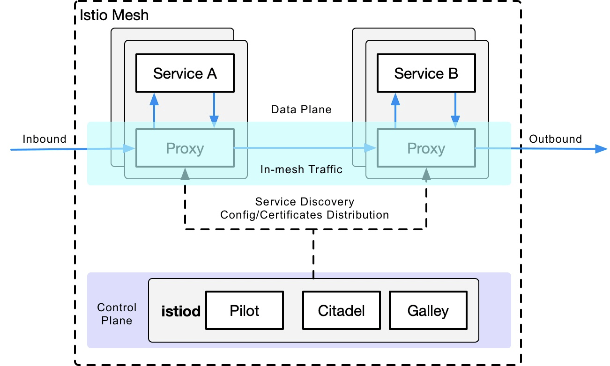

# resilient-config
복원력을 위한 아키텍쳐 구성 가이드

## 시작하기전에

본문의 내용은 마이크로소프트 애저 [WAF, Well-Architected Framework](https://docs.microsoft.com/en-us/azure/architecture/framework/)를 기반으로 하며 다음의 레퍼런스를 참조함. 

- [복원력 있는 애플리케이션 구현](https://docs.microsoft.com/ko-kr/dotnet/architecture/microservices/implement-resilient-applications/)
- [클라우드 응용프로그램의 모범사례](https://docs.microsoft.com/ko-kr/azure/architecture/best-practices/index-best-practices)

[복원력 있는 애플리케이션 구현](https://docs.microsoft.com/ko-kr/dotnet/architecture/microservices/implement-resilient-applications/) 은 닷넷의 사례이기는 하나 설계원리는 언어에 특정되지 않고 공통적으로 적용됨

이것보다 상위 레벨의 가이드는 [클라우드 디자인 패턴](https://docs.microsoft.com/ko-kr/azure/architecture/patterns/) 참조

## 도입

소프트웨어 복원력의 주요 목표는 해당 범위 내에서 결함을 허용할 수 있는 최대한의 구성을 이루는것. 자동 장애복구 (failover) 또는 이중화와 같은 방식으로 구성요소의 내결함성을 구현, 최근에는 상식으로 받아들여지는 경향. 간단한 웹 애플리케이션에도 웹 서버, 데이터베이스, 방화벽, 프록시, 로드 밸런서 및 캐시서버 등이 포함되고, 또한 네트워크 인프라는 너무 많은 구성 요소로 구성되어 항상 어딘가에서 오류가 발생함. 전체실패 시나리오 외에도 서비스 응답시간의 지체도 고려, 응답 형식이 정확하더라도 응답의 의미상의 오류를 발생하기도 함. 더 많은 구성 요소를 포함할 수록 실패 가능성은 상승함

### 가용성

가용성은 구성요소 서비스의 중요 품질속성으로 간주됨. 구성요소 서비스의 전체시간 대비 실제로 사용할 수 있는 시간으로 산정함

```javascript
가용성 = 업타임 / (전체시간 = 업타임 + 다운타임)
```

전통적인 접근 방식은 업타임을 늘리는 것을 목표로 하는 반면 현대적인 접근 방식은 복구시간을 줄여 전체 다운타임을 줄이는 것을 목표로함. 오류가 발생할 경우 불가용한 상태를 지속하는 대신 오류를 능동적으로 처리하거나 감지할수 있게되어 가용성 개선에 매우 유리함

본문에서는 복구시간 제어 수간으로서 Retry, fallback, timeout 및 circuit breaker 의 네 가지 패턴을 설명함
이밖에도 본문에서 직접 다루지 않으나 복원력 확보를 위해서 메트릭, 로그의 수집, 모니터링은 매우 중요함

## 패턴 

### 1. Retry / 재시도

예상치 못한 응답(또는 요청에 응답없음)에 요청을 다시 전송하여 수정할 수 있다고 가정하면, 재시도 패턴을 사용하는 것이 도움됨. 작업이 실패로 표시되기 전에 실패한 경우 실패한 요청이 가능한 횟수만큼 재시도되는 매우 간단한 패턴

재시도는 다음과 같은 경우에 유용함

- 모든 종류의 가용성 문제 또는 connection (request) failure에 대해서 적용가능
- 패킷 손실과 같은 일시적인 네트워크 문제
- 대상 서비스의 내부 오류 (예: 데이터베이스 중단으로 인한)
- 대상 서비스에 대한 많은 요청으로 인해 응답이 없거나 느린 경우
- 그러나 대상 서비스에 과부하가 걸려 문제가 발생한 경우 재시도하면 문제가 더욱 악화될 수 있습니다. 복원 패턴이 서비스 거부 공격으로 바뀌는 것을 방지하기 위해서, 재시도 횟수, 간격, 지연 등으로 제한하며, 다음 절에서 설명하는 Fallback, Circuit Breaker 등과 함께 적용

> Note: Insert/Update/Delete가 포함된 DB쿼리시 주의. 단, 이경우에도 Auto Commit 으로 설정된 경우에는 무리없이 적용 가능함

> Note: 사용자 애플리케이션 -> 프레임워크 (ex. 커넥션풀, MyBatis등 ORM) -> 커넥터 (ex. JDBC드라이버) 등으로 구성될 경우, 재시도가 각 단계에서 중복 적용되지 않도록 주의 합니다. 어느 단계중 한곳에 적용할 것을 권장하며, 현재 애플리케이션에 적용된 프레임워크, 커넥터에서 Retry Option, Reconnect Option 등을 제공하는지 여부를 먼저 확인하십시오

#### 1.1. 일시적인 오류처리

원격 서비스 및 리소스와 통신하는 모든 애플리케이션은 일시적인 오류에 반응해야만 합니다. 특히 클라우드에서 실행되는 애플리케이션의 경우는 더욱 그렇습니다. 이러한 애플리케이션에서는 환경 및 인터넷을 통한 연결이라는 특성으로 인해 이러한 유형의 오류가 더 자주 발생할 수 있습니다. 일시적인 오류로는 구성 요소 및 서비스의 순간적인 네트워크 연결 끊김, 서비스의 일시적인 사용 중단, 서비스가 사용 중일 때 발생하는 시간 제한 등이 있습니다. 이러한 오류는 자동으로 수정 되는 경우가 많으며, 적절 한 지연 후 작업이 반복 되 면 성공할 가능성이 높습니다. 

[일시적인 오류처리](https://docs.microsoft.com/ko-kr/azure/architecture/best-practices/transient-faults) 참조

#### 1.2. 애저 서비스를 위한 Retry 가이드

대부분의 Azure 서비스 및 클라이언트 SDK는 재시도 메커니즘을 제공합니다. 그러나 서비스마다 특성 및 요구 사항이 다르기 때문에 이러한 메커니즘을 서로 다르므로 각 재시도 메커니즘은 특정 서비스에 맞게 조정됩니다. 

[애저 서비스를 위한 Retry 가이드](https://docs.microsoft.com/en-us/azure/architecture/best-practices/retry-service-specific) 참조

자주 사용되는 컴포넌트에 대한 Retry 패턴 적용 가이드는 아래와 같습니다
- [CosmosDB](https://docs.microsoft.com/en-us/azure/architecture/best-practices/retry-service-specific#cosmos-db)
- [Redis](https://docs.microsoft.com/en-us/azure/architecture/best-practices/retry-service-specific#azure-cache-for-redis)

### 2. Fallback / 대체

대체 패턴을 사용하면 다른 서비스에 대한 요청이 실패한 경우 또는 응답 누락으로 인해 진행을 중단하는 대신 대체 값을 사용함. 대체 패턴이 항상 가능한 것은 아니지만 신중하게 사용하면 전반적인 복원력을 크게 향상. 주로 DB 쿼리에 해당되며, 비즈니스 로직과 데이터의 특성을 고려해야함 

### 3. Timeouts / 타임아웃

타임아웃 패턴은 매우 간단하며 많은 대부분의 네트워크 전송 프로토콜에는 기본 타임아웃이 포함되 있음. 목표는 응답에 대한 무한한/지나치게 긴 대기시간을 피하여 제한시간 내에 응답이 수신되지 않은 모든 요청을 실패한 것으로 처리하여 재빨리 복구 흐름을 타게하는것

타임아웃은 거의 모든 애플리케이션에서 사용되고 있음. 그러나 그것을 처리하는것은 주의가 필요함. 온라인 상점에서 주문 시를 예로들면, 주문 타임아웃 에러시 주문이 성공적으로 접수되었는지 확신할 수 없게되어 주문 생성이 아직 진행 중이거나 요청이 처리되지 않은채로 응답시간이 초과된 경우, 이때 재시도와 결합하면 중복주문이 발생하게됨. 주문을 실패로 표시하여 고객이 주문이 성공하지 못한것을 인지하도록 하며, 고객이 스스로 주문을 재시도하도록 하는것이 타당함. 이러한 시나리오는 모든 트랜잭션에 대해 적용할 수 없으며, 타임아웃 이후의 처리는 유즈케이스 별로 판단해야 함

데이터 처리가 요구되는 백엔드 서비스에 요청하는 경우, 응답이 도착할 수 있을 만큼 충분히 크게 하지만, 결국 도착하지 않을 응답을 기다리지 않을 만큼 충분히 낮은 타임아웃을 설정해야함. 단 connect timeout 은 충분히 짧게 유지함

### 4. Circuit breaker / 회로차단기 / 서킷브레이커

전자제품에서 서킷브레이커는 과부하로 인한 손상으로부터 구성요소를 보호하는 스위치임. 소프트웨어에서 서킷브레이커는 과부하로 인해 이미 부분적으로 사용할 수 없는 동안 과도한 트래픽이 발생하지 않도록하고 전체 서비스중단을 방지하여 시스템을 보호함

서킷브레이커 패턴은 [Martine Fowler](https://martinfowler.com/bliki/CircuitBreaker.html)의 정의를 따름. 닫힘(흐름), 열림(차단), 반개방(지연/실패) 세가지 상태로 정의함


실제 업무 시나리오의 예를들면 결제서비스에서 사기수표 서비스로의 요청에 서킷브레이커를 삽입하면, 두개의 내부 사기수표 서비스 오류 발생 후 회로가 열리고 후속 요청이 차단. 약간의 대기 시간 후에 회로는 반개방 상태. 이 상태에서는 하나의 요청을 통과하고 실패할 경우 열린 상태로 다시 변경하여 계속 차단하거나, 성공할 경우 닫힌 상태로 변경. 다음 요청이 성공하여 회로가 다시 닫힙니다.

서킷브레이커는 특히 재시도, 시간초과 및 대체 패턴등과 결합될 때 유용함. 자체적으로 실패할 가능성이 있는 작업에 묶여 있는 리소스를 줄이는데 도움이됨. 클라이언트에 대한 시간 초과 대기를 피하고 회로가 끊어지면 문제가 있는 서버에 부하가 걸리는 것을 방지하게됨. 서킷브레이커는 모니터링을 위해서 사용하기도함. 모든 상태변경이 기록되어야 하며 서킷브레이커는 심층 모니터링을 위해 상태 세부정보를 공개해야 합니다. 동시에 클라이언트는 서킷브레이커 오류 대응이 요구됨. 모든 원격 호출과 마찬가지로 실패시 수행할 작업을 고려해야함. 즉, 실패 다음의 처리 - 대기열에 추가 등의 고려가 필요함

앞서 언급한것과 같이 예외에 대한 후속 처리가 필요한 경우가 아니라면 서킷브레이커는 코드의 변경없이 투명하게 적용가능하고, 네트워크상의 서킷브레이커 배치시 언어 중립적인 특징이 있음. 이때에는 예외처리가 다소 제한되고, HTTP로 한정되는 경우가 많음

대표적으로 다음과 같은 컴포넌트를 적용 가능함

- [DAPR](https://github.com/dapr/dapr)
- [Hystrix](https://github.com/Netflix/Hystrix)
- [ISTIO](https://istio.io/latest/docs/tasks/traffic-management/circuit-breaking/)
- [NGINX](https://www.nginx.com/blog/microservices-reference-architecture-nginx-circuit-breaker-pattern/)

클라이언트 툴킷과 함께 적용되는것

- Java/Spring [Spring Cloud Circuit Breaker](https://spring.io/projects/spring-cloud-circuitbreaker) : Netfix Hystrix, Resilience4J, Sentinel, Spring Retry 지원
- .NET [Polly](https://github.com/App-vNext/Polly)
- Python [Pyfailsafe](https://github.com/Skyscanner/pyfailsafe)
- Node.js [Opossum](https://github.com/nodeshift/opossum)
- Golang [go-chassis](https://github.com/go-chassis/go-chassis)

### 4.1. Sidecar / 사이드카

격리 및 캡슐화를 제공하는 별도의 프로세스 또는 컨테이너에 애플리케이션 구성 요소를 배포합니다. 이 패턴을 사용하면 애플리케이션을 서로 다른 유형의 구성 요소 및 기술로 구성할 수도 있습니다. 패턴에서 사이드카는 상위 애플리케이션에 연결되고 애플리케이션에 대한 지원 기능을 제공합니다. 또한 사이드카는 상위 애플리케이션과 동일한 수명 주기를 공유하므로 상위 애플리케이션과 함께 만들어지고 사용 중지됩니다. 사이드카 패턴은 경우에 따라 사이드킥 패턴이라고도 하며 분해 패턴입니다. 사이드카는 서킷브레이커와 유사한 기능을 서비스 컴포넌트 측에서 수행함

[사이드카 패턴](https://docs.microsoft.com/ko-kr/azure/architecture/patterns/sidecar) 참조

사이드카는 통상적으로 VM또는 컨테이너 단위로 애플리케이션과 함께 배포됨. 서킷브레이커과 함께 또는 개별적으로 적용함. 즉, Azure Kubernetes Service (AKS) 적용시 Pod 내에 사이드카, 클러스터에 서킷브레이커를 배치하며, 각각 Envoy-ISTIO 같은 조합으로 구성함. 아래 그림은 ISTIO 기본 Proxy로 Envoy가 함께 구성된 사례



## 정리하기

재시도 패턴을 사용하면 여러 번 시도하여 수정할 수 있는 통신 오류에 대응, 대체 패턴은 로컬에서 통신 오류를 해결하는 데 도움이 되지만, 비즈니스 로직상의 고려가 필요함. 시간초과 패턴은 대기시간의 최대치를 제한하고, 서킷브레이커는 통신 오류가 지속되는 경우 재시도 및 빠른 폴백으로 인한 우발적인 서비스 거부(Denial) 공격 리스크를 회피하게됨

## 다음주제

- [Resilient Design](REAMD.md)
- [Resilient Config for SpringBoot](resilient-config-spring-boot.md)
- [Resilient Config for Generic Java](resilient-config-generic-java.md)
- [Resilient Config for Python](resilient-config-python.md)
- [Resilient Config for Node.js](resilient-config-nodejs.md)
- [Resilient Config for Golang](resilient-config-golang.md)
